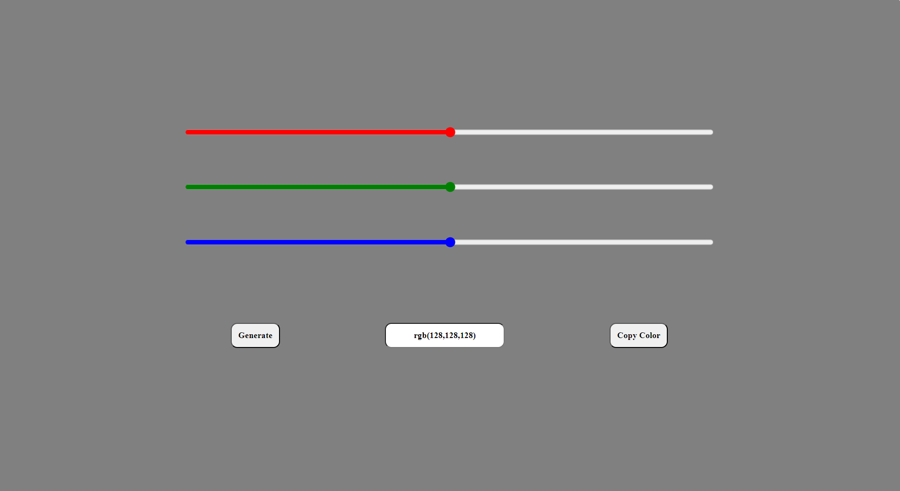

# Color Generator

1. A basic Color Generator
1. Made with HTML CSS AND Javascript
1. Responsive to different screen sizes using media queries.

## Features 🚀

1. Easy to Use
1. Random Color Generator Everytime.
1. Display of Each Color Code in rgb form.
1. You can copy the color code.

## How to Use 🤔

1. Download or clone this repository onto your local machine.
1. Open `index.html` file located at the `./index.html` using a web browser.
1. You Can Click on Generate Button or Simply move or select the range to change the color value.
1. Click on Copy Color to copy the displaying color value.

## Preview This Project

